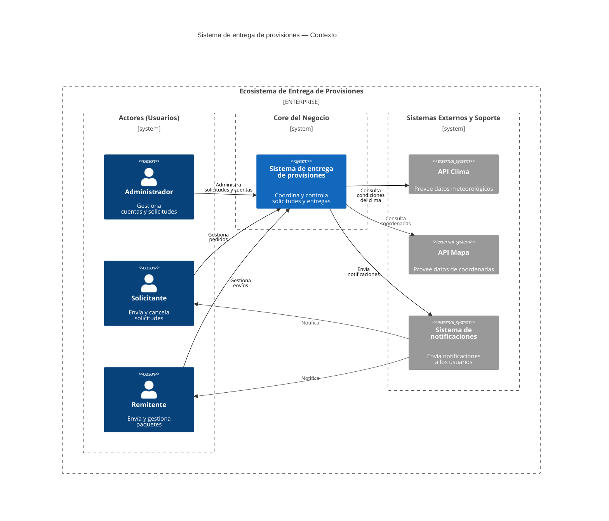
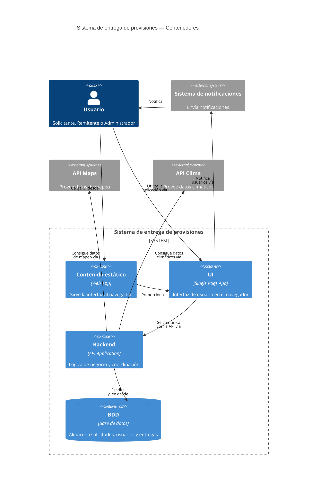
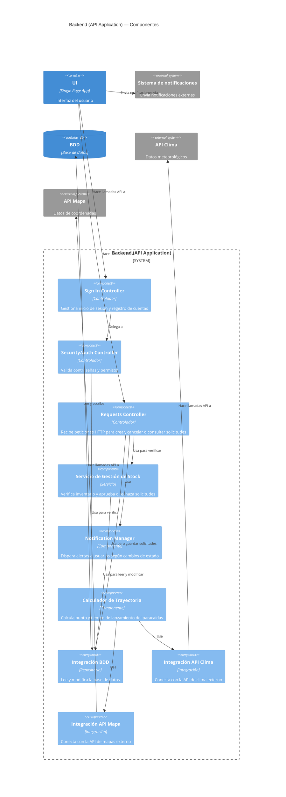

**Contexto (Nivel 1)**

```mermaid
C4Context
  title Sistema de entrega de provisiones — Contexto

  Enterprise_Boundary(b0, "Ecosistema de Entrega de Provisiones") {
    
    %% CAPA SUPERIOR
    Boundary(b1, "Actores (Usuarios)") {
      Person(admin, "Administrador", "Gestiona <br>cuentas y solicitudes")
      Person(solicitante, "Solicitante", "Envía y cancela <br>solicitudes")
      Person(remitente, "Remitente", "Envía y gestiona<br> paquetes")
    }

    %% CAPA CENTRAL
    Boundary(b2, "Core del Negocio") {
      System(sistema, "Sistema de entrega<br> de provisiones", "Coordina y controla <br>solicitudes y entregas")
    }

    %% CAPA INFERIOR
    Boundary(b3, "Sistemas Externos y Soporte") {
      System_Ext(apiClima, "API Clima", "Provee datos meteorológicos")
      System_Ext(apiMapa, "API Mapa", "Provee datos de coordenadas")
      System_Ext(notif, "Sistema de <br>notificaciones", "Envía notificaciones <br>a los usuarios")
    }
  }

  %% Relaciones de Capa 1 a Capa 2
  Rel(admin, sistema, "Administra<br> solicitudes y cuentas")
  Rel(solicitante, sistema, "Gestiona<br> pedidos")
  Rel(remitente, sistema, "Gestiona<br> envíos")

  %% Relaciones de Capa 2 a Capa 3
  Rel(sistema, apiClima, "Consulta <br>condiciones <br>del clima")
  Rel(sistema, apiMapa, "Consulta<br> coordenadas")
  Rel(sistema, notif, "Envía<br> notificaciones")

  %% Notificaciones de vuelta a usuarios (Capa 3 a Capa 1)
  Rel(notif, solicitante, "Notifica")
  Rel(notif, remitente, "Notifica")

    UpdateRelStyle(admin, sistema, $textColor="black", $lineColor="black", $offsetX="-50", $offsetY="-20")
    UpdateRelStyle(sistema, apiClima, $textColor="black", $lineColor="black", $offsetX="-50", $offsetY="20")
    UpdateRelStyle(sistema, notif, $textColor="black", $lineColor="black", $offsetX="-80", $offsetY="20")
    UpdateRelStyle(solicitante, sistema, $textColor="black", $lineColor="black", $offsetX="-70", $offsetY="-15")
    UpdateRelStyle(remitente, sistema, $textColor="black", $lineColor="black", $offsetX="-15", $offsetY="-15")
    UpdateLayoutConfig($c4ShapeInRow="3", $c4BoundaryInRow="3")
```

---

**Contenedores (Nivel 2)**

```mermaid
C4Container
  title Sistema de entrega de provisiones — Contenedores

  Person(usuario, "Usuario", "Solicitante, Remitente o Administrador")

  System_Boundary(sistema, "Sistema de entrega de provisiones") {
    Container(webApp, "Contenido estático", "Web App", "Sirve la interfaz al navegador")
    Container(ui, "UI", "Single Page App", "Interfaz de usuario en el navegador")
    Container(backend, "Backend", "API Application", "Lógica de negocio y coordinación")
    ContainerDb(bdd, "BDD", "Base de datos", "Almacena solicitudes, usuarios y entregas")
  }

  System_Ext(notif, "Sistema de notificaciones", "Envía notificaciones")
  System_Ext(apiMapa, "API Maps", "Provee datos de mapeo")
  System_Ext(apiClima, "API Clima", "Provee datos climáticos")

  Rel(usuario, webApp, "Carga UI desde")
  UpdateRelStyle(usuario, webApp, $textColor="black", $lineColor="black", $offsetX="-95", $offsetY="-20")
  Rel(webApp, ui, "Proporciona")
  UpdateRelStyle(webApp, ui, $textColor="black", $lineColor="black", $offsetX="-35", $offsetY="20")
  Rel(usuario, ui, "Utiliza la<br> aplicación vía")
  UpdateRelStyle(usuario, ui, $textColor="black", $lineColor="black", $offsetX="-45", $offsetY="-20")
  Rel(ui, backend, "Se comunica<br> con la API vía")
  UpdateRelStyle(ui, backend, $textColor="black", $lineColor="black", $offsetX="-40", $offsetY="20")
  Rel(ui, notif, "Notifica <br>usuarios vía")
  UpdateRelStyle(ui, notif, $textColor="black", $lineColor="black", $offsetX="-65", $offsetY="-20")
  Rel(backend, bdd, "Escribe <br>y lee desde")
   UpdateRelStyle(backend, bdd, $textColor="black", $lineColor="black", $offsetX="-40", $offsetY="20")
  Rel(backend, apiMapa, "Consigue datos <br>de mapeo vía")
  UpdateRelStyle(backend, apiMapa, $textColor="black", $lineColor="black", $offsetX="-80", $offsetY="-20")
  
  Rel(backend, apiClima, "Consigue datos<br> climáticos vía")
  UpdateRelStyle(backend, apiClima, $textColor="black", $lineColor="black", $offsetX="10", $offsetY="-20")
  Rel(notif, usuario, "Notifica")
  UpdateRelStyle(notif, usuario, $textColor="black", $lineColor="black", $offsetX="-20", $offsetY="-20")
```

---

**Componentes (Nivel 3)**

```mermaid
C4Component
  title Backend (API Application) — Componentes

  Container(ui, "UI", "Single Page App", "Interfaz del usuario")
  System_Ext(notifExt, "Sistema de notificaciones", "Envía notificaciones externas")

  System_Boundary(backend, "Backend (API Application)") {
    Component(signIn, "Sign In Controller", "Controlador", "Gestiona inicio de sesión y registro de cuentas")
    Component(authCtrl, "Security/Auth Controller", "Controlador", "Valida contraseñas y permisos")
    Component(reqCtrl, "Requests Controller", "Controlador", "Recibe peticiones HTTP para crear, cancelar o consultar solicitudes")
    Component(stockSvc, "Servicio de Gestión de Stock", "Servicio", "Verifica inventario y aprueba o rechaza solicitudes")
    Component(notifMgr, "Notification Manager", "Componente", "Dispara alertas a usuarios según cambios de estado")
    Component(calcTray, "Calculador de Trayectoria", "Componente", "Calcula punto y tiempo de lanzamiento del paracaídas")
    Component(intBdd, "Integración BDD", "Repositorio", "Lee y modifica la base de datos")
    Component(intClima, "Integración API Clima", "Integración", "Conecta con la API de clima externo")
    Component(intMapa, "Integración API Mapa", "Integración", "Conecta con la API de mapas externo")
  }

  ContainerDb(bdd, "BDD", "Base de datos")
  System_Ext(apiClima, "API Clima", "Datos meteorológicos")
  System_Ext(apiMapa, "API Mapa", "Datos de coordenadas")

  Rel(ui, signIn, "Hace llamadas API a")
  Rel(ui, reqCtrl, "Hace llamadas API a")
  Rel(ui, notifExt, "Envía notificaciones vía")
  Rel(signIn, authCtrl, "Delega a")
  Rel(authCtrl, intBdd, "Usa para verificar")
  Rel(reqCtrl, stockSvc, "Usa para verificar")
  Rel(reqCtrl, notifMgr, "Usa")
  Rel(reqCtrl, intBdd, "Usa para guardar solicitudes")
  Rel(stockSvc, intBdd, "Usa para leer y modificar")
  Rel(calcTray, intClima, "Usa")
  Rel(calcTray, intMapa, "Usa")
  Rel(intBdd, bdd, "Lee y escribe")
  Rel(intClima, apiClima, "Hace llamadas API a")
  Rel(intMapa, apiMapa, "Hace llamadas API a")
```
