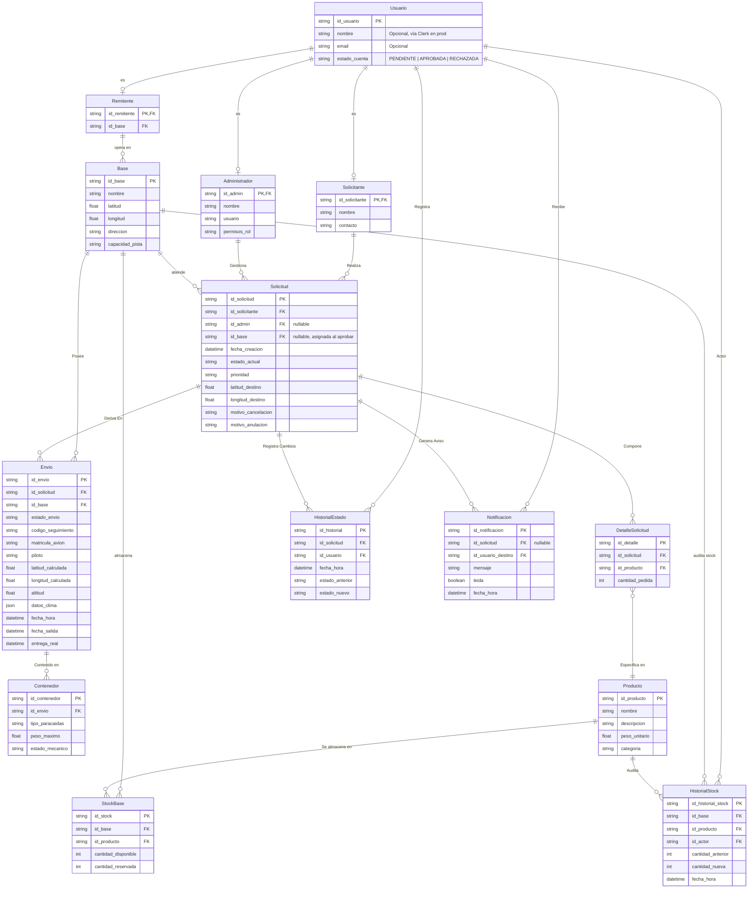

# Diagrama ER
 + Basado en diagrama de entregable 3 

```mermaid
%%---
%%config:
  %%layout: elk
%%---
erDiagram
    Usuario {
        string id_usuario PK
        string nombre "Opcional, vía Clerk en prod"
        string email "Opcional"
        string estado_cuenta "PENDIENTE | APROBADA | RECHAZADA"
    }

    Solicitante {
        string id_solicitante PK, FK
        string nombre
        string contacto
    }

    Administrador {
        string id_admin PK, FK
        string nombre
        string usuario
        string permisos_rol
    }

    Remitente {
        string id_remitente PK, FK
        string id_base FK
    }

    Base {
        string id_base PK
        string nombre
        float latitud
        float longitud
        string direccion
        string capacidad_pista
    }

    Solicitud {
        string id_solicitud PK
        string id_solicitante FK
        string id_admin FK "nullable"
        string id_base FK "nullable, asignada al aprobar"
        datetime fecha_creacion
        string estado_actual
        string prioridad
        float latitud_destino
        float longitud_destino
        string motivo_cancelacion
        string motivo_anulacion
    }
    

    Envio {
        string id_envio PK
        string id_solicitud FK
        string id_base FK
        string estado_envio
        string codigo_seguimiento
        string matricula_avion
        string piloto
        float latitud_calculada
        float longitud_calculada
        float altitud
        json datos_clima
        datetime fecha_hora
        datetime fecha_salida
        datetime entrega_real
    }

    Contenedor {
        string id_contenedor PK
        string id_envio FK
        string tipo_paracaidas
        float peso_maximo
        string estado_mecanico
    }


    StockBase {
        string id_stock PK
        string id_base FK
        string id_producto FK
        int cantidad_disponible
        int cantidad_reservada
    }

    DetalleSolicitud {
        string id_detalle PK
        string id_solicitud FK
        string id_producto FK
        int cantidad_pedida
    }
     Producto {
        string id_producto PK
        string nombre
        string descripcion
        float peso_unitario
        string categoria
    }

    HistorialEstado {
        string id_historial PK
        string id_solicitud FK
        string id_usuario FK
        datetime fecha_hora
        string estado_anterior
        string estado_nuevo
    }

    HistorialStock {
        string id_historial_stock PK
        string id_base FK
        string id_producto FK
        string id_actor FK
        int cantidad_anterior
        int cantidad_nueva
        datetime fecha_hora
    }

    Notificacion {
        string id_notificacion PK
        string id_solicitud FK "nullable"
        string id_usuario_destino FK
        string mensaje
        boolean leida
        datetime fecha_hora
    }

    Usuario ||--o| Solicitante : "es"
    Usuario ||--o| Administrador : "es"
    Usuario ||--o| Remitente : "es"
    Usuario ||--o{ HistorialEstado : "Registra"
    Usuario ||--o{ Notificacion : "Recibe"
    Usuario ||--o{ HistorialStock : "Actor"
    
    Solicitante ||--o{ Solicitud : "Realiza"
    Remitente ||--o{ Base : "opera en"
    
    Administrador ||--o{ Solicitud : "Gestiona"

    Base ||--o{ StockBase : "almacena"
    Base ||--o{ Envio : "Posee"
    Base ||--o{ Solicitud : "atiende"
    Base ||--o{ HistorialStock : "audita stock"
    
    Solicitud ||--o{ Envio : "Deriva En"
    Solicitud ||--o{ DetalleSolicitud : "Compone"
    Solicitud ||--o{ HistorialEstado : "Registra Cambios"
    Solicitud ||--o{ Notificacion : "Genera Aviso"
    Envio ||--o{ Contenedor : "Contenido en"
    DetalleSolicitud }o--|| Producto : "Especifica en"
      
    Producto ||--o{ StockBase : "Se almacena en"
    Producto ||--o{ HistorialStock : "Audita"
```
