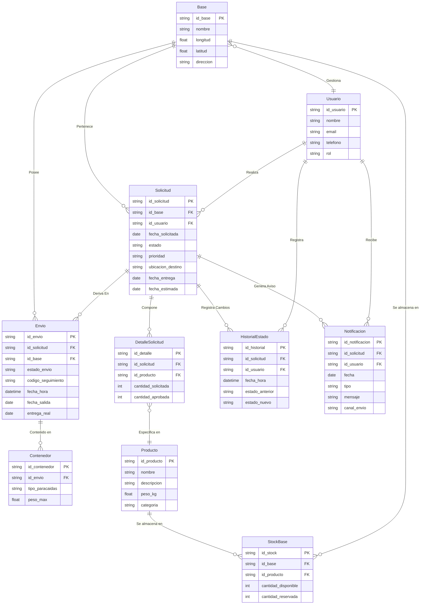

# Diagrama ER
 + Bsasdi en entregable 3 

```mermaid
%%---
%%config:
  %%layout: elk
%%---
erDiagram
    Usuario {
        string id_usuario PK
        string nombre
        string email
        string telefono
        string rol
    }

    Base {
        string id_base PK
        string nombre
        float longitud
        float latitud
        string direccion
    }

    Solicitud {
        string id_solicitud PK
        string id_base FK
        string id_usuario FK
        date fecha_solicitada
        string estado
        string prioridad
        string ubicacion_destino
        date fecha_entrega
        date fecha_estimada
    }
    

    Envio {
        string id_envio PK
        string id_solicitud FK
        string id_base FK
        string estado_envio
        string codigo_seguimiento
        datetime fecha_hora
        date fecha_salida
        date entrega_real
    }

    Contenedor {
        string id_contenedor PK
        string id_envio FK
        string tipo_paracaidas
        float peso_max
    }


    StockBase {
        string id_stock PK
        string id_base FK
        string id_producto FK
        int cantidad_disponible
        int cantidad_reservada
    }

    DetalleSolicitud {
        string id_detalle PK
        string id_solicitud FK
        string id_producto FK
        int cantidad_solicitada
        int cantidad_aprobada
    }
     Producto {
        string id_producto PK
        string nombre
        string descripcion
        float peso_kg
        string categoria
    }

    HistorialEstado {
        string id_historial PK
        string id_solicitud FK
        string id_usuario FK
        datetime fecha_hora
        string estado_anterior
        string estado_nuevo
    }

    Notificacion {
        string id_notificacion PK
        string id_solicitud FK
        string id_usuario FK
        date fecha
        string tipo
        string mensaje
        string canal_envio
    }
    Usuario ||--o{ Solicitud : "Realiza"
    Base ||--o{ Solicitud : "Pertenece"
    Base }o--||Usuario: "Gestiona"
    Usuario ||--o{ HistorialEstado : "Registra"
    Usuario ||--o{ Notificacion : "Recibe"
    
    Solicitud ||--o{ Envio : "Deriva En"
    Base ||--o{ StockBase : "Se almacena en"
    Base ||--o{ Envio : "Posee"
    
    Solicitud ||--o{ DetalleSolicitud : "Compone"
    Solicitud ||--o{ HistorialEstado : "Registra Cambios"
    Solicitud ||--o{ Notificacion : "Genera Aviso"
    Envio ||--o{ Contenedor : "Contenido en"
    DetalleSolicitud }o--|| Producto : "Especifica en"
      
    Producto ||--o{ StockBase : "Se almacena en"
```
- LLM puso `deriva en` (relación) como `1-1` en el diagrama original esta como `1-N`
