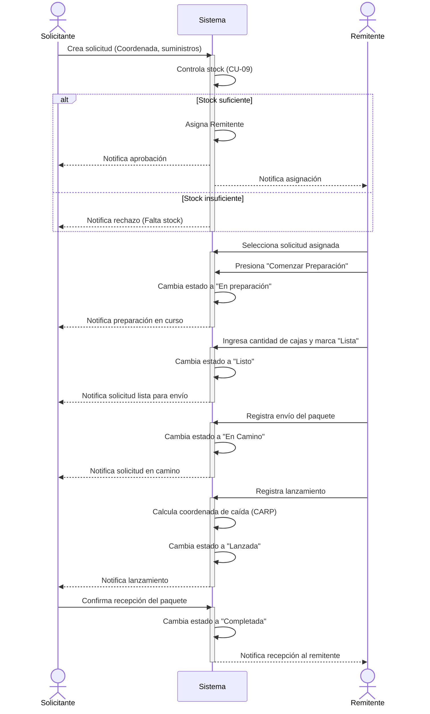
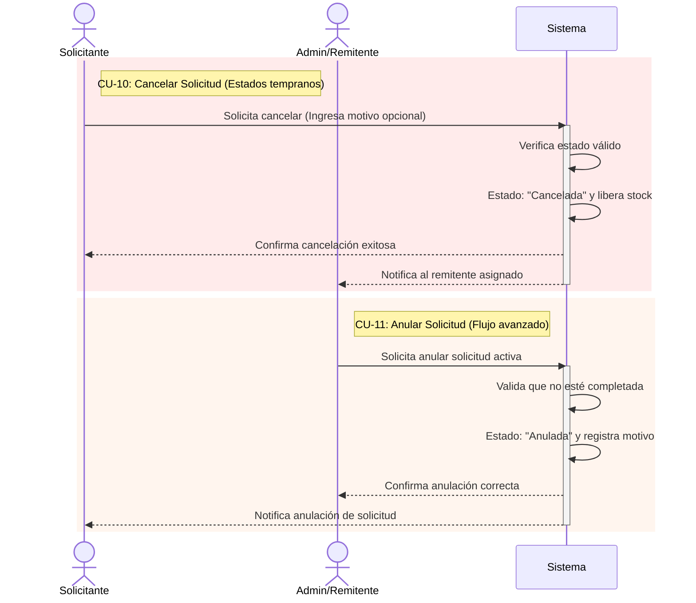
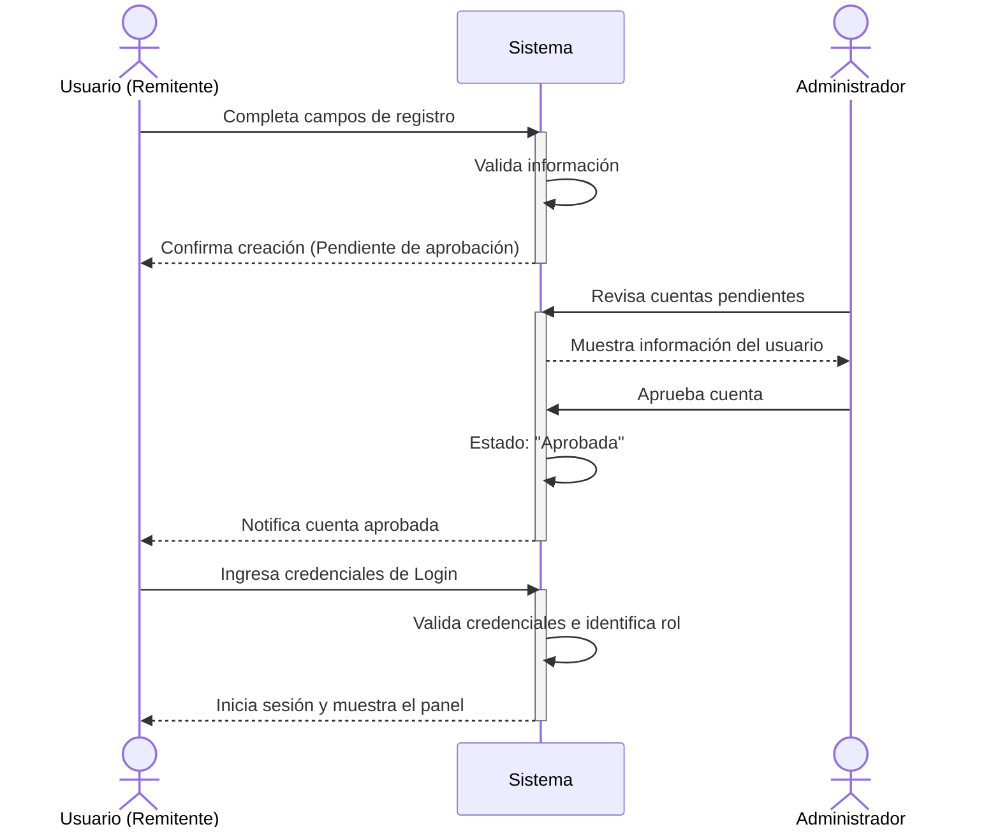
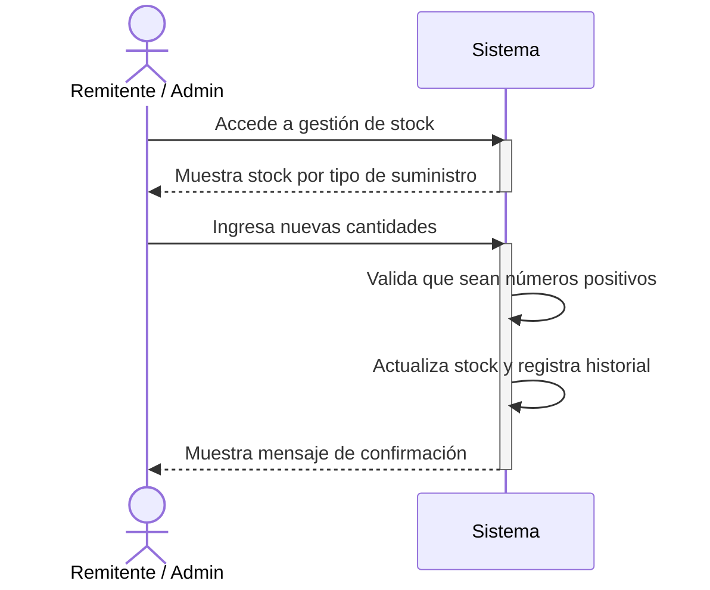

# Diagramas de secuencia del sistema SUMI
 + generados a partir de los casos de uso especificados
## 1. Ciclo de vida principal de la solicitud

## 2. Interrupciones del Flujo (Cancelaciones & Anulaciones)

## 3. Registro y Autenticación de Cuentas (Enfoque Remitente)

## 4. Gestión independiente de Stock

