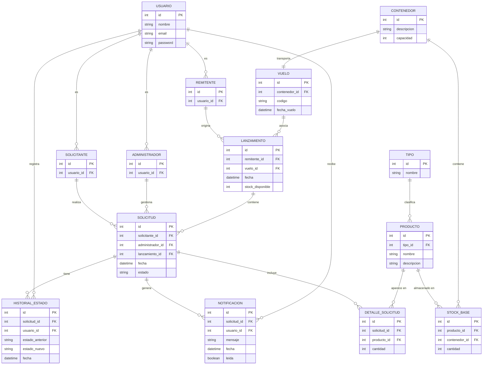

# Diagrama Entidad Relación
(basado en el original hecho por nacho)
 + **Herencia de Usuario** — `Remitente`, `Administrador` y `Solicitante` heredan de `Usuario` mediante una relación uno a uno opcional, tal como indica la nota del diagrama original.
 + **Historial de Estado con usuario** — incluí la relación de `HISTORIAL_ESTADO` con `USUARIO` para poder saber quién realizó cada cambio de estado
 + **Notificación** — la incluí y la vinculé tanto a `SOLICITUD` como a `USUARIO`, para que se pueda recuperar el historial de actualizaciones al volver a la sesión.
 + **Lanzamiento ↔ Remitente** — el lanzamiento sale del remitente, por lo que el stock se descuenta desde ahí. No tracé una línea directa entre `Remitente` y `Lanzamiento` como alternativa separada, sino que la relación queda clara mediante la FK.
 + **Entidad `Avion`** — la omití por el momento hasta confirmar su integración. Si la confirman, se puede agregar fácilmente como entidad relacionada a `Vuelo`.
 + **Stock-Base** — la mantuve vinculada tanto a `Producto` como a `Contenedor`, representando el inventario físico por contenedor.

